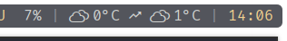

# westatus
Cool status application written in C# using ASP.NET

## Usage
westatus hosts a simple http server which can be queried for information, meant for integration with status bars like polybar or dwm-bar

To run westatus, compile it (requires .NET 8, preferrably to a single file (`dotnet publish --os=linux -p:SingleFilePublish=true`)), and then run it on startup

Currently supports simple weather integration using open-metro

Can be configured using a toml file, see the [example config file](config.example.toml)

By default, westatus loads the config file from ~/.config/westatus/config.toml, but this can be overridden with a command line parameter

## Polybar integration
Requires the https://erikflowers.github.io/weather-icons/ and https://zavoloklom.github.io/material-design-iconic-font/ icon fonts to work properly

Load them into polybar in your config.ini
```ini
[bar/example]
...

font-1 = Weather Icons:size=14;4
font-2 = Material\\-Design\\-Iconic\\-Font:style=Design-Iconic-Font;2

...
```

Example weather module for polybar
```ini
[module/weather]
type = custom/script
exec = curl -s http://localhost:40001/weather
interval = 60
```

Result:



# TODO
TODO:
- Add precipitation chance/amount
- Add more status stuff
- idk clean up code?